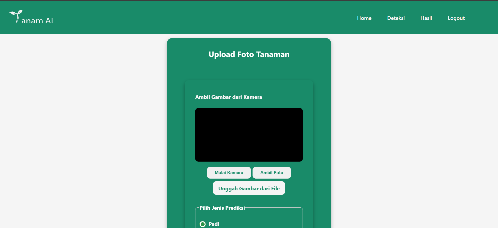

# TanamAI: Deteksi Penyakit & Hama Tanaman Pangan Berbasis Citra

**ID Tim: CC25-CF180 | Tema: Environment and Sustainability**

Repositori ini berisi kode sumber dan dokumentasi untuk TanamAI, sebuah aplikasi web yang dirancang untuk membantu petani mendeteksi penyakit dan hama pada tanaman pangan utama di Indonesia (padi, jagung, dan kentang) menggunakan teknologi *machine learning*.

---

## Daftar Isi
- [Latar Belakang](#latar-belakang)
- [Fitur Utama](#fitur-utama)
- [Tampilan Aplikasi](#tampilan-aplikasi)
- [Tumpukan Teknologi (Tech Stack)](#tumpukan-teknologi-tech-stack)
- [Struktur Proyek](#struktur-proyek)
- [Panduan Penggunaan](#panduan-penggunaan)
  - [Prasyarat](#prasyarat)
  - [Instalasi](#instalasi)
  - [Menjalankan Aplikasi](#menjalankan-aplikasi)
- [Tautan Aplikasi](#tautan-aplikasi)
- [Tim Kami](#tim-kami)
- [Sumber Data & Referensi](#sumber-data--referensi)

---

## Latar Belakang

Produktivitas pertanian di Indonesia menghadapi tantangan serius dari serangan hama dan penyakit yang seringkali terlambat dideteksi. Keterlambatan ini menyebabkan penurunan hasil panen yang signifikan, seperti penurunan produksi beras hingga 2,05% [cite: 93] dan potensi kehilangan hasil jagung hingga 40% [cite: 94], yang sebagian besar disebabkan oleh proses deteksi manual yang subjektif dan tidak konsisten. TanamAI dikembangkan untuk menjembatani kesenjangan ini dengan menyediakan solusi teknologi yang cepat, akurat, dan mudah diakses.

Dengan memanfaatkan model *machine learning* berbasis *Deep Learning* (arsitektur MobileNetV2) [cite: 157, 278], aplikasi ini memungkinkan petani untuk mengunggah foto daun tanaman melalui *smartphone*  dan secara instan mendapatkan diagnosis kemungkinan penyakit atau hama, lengkap dengan rekomendasi penanggulangan secara organik dan anorganik. Proyek ini bertujuan untuk memberdayakan petani, meningkatkan efisiensi, dan mendukung ketahanan pangan nasional.

## Fitur Utama

-   **Deteksi Multi-tanaman**: Mampu mengidentifikasi penyakit pada tanaman Padi, Jagung, dan Kentang, serta beberapa jenis hama umum.
-   **Prediksi Berbasis Citra**: Pengguna cukup mengunggah foto daun tanaman melalui kamera atau galeri untuk memulai proses deteksi.
-   **Hasil Prediksi Akurat**: Menampilkan beberapa kemungkinan penyakit/hama dengan persentase keyakinan berdasarkan analisis model.
-   **Rekomendasi Solusi Lengkap**: Memberikan saran penanggulangan secara **organik** dan **anorganik** (kimiawi) untuk setiap penyakit yang terdeteksi.
-   **Tautan Produk**: Menyediakan tautan langsung ke platform *e-commerce* (Tokopedia, Shopee, Blibli) untuk membeli produk penanggulangan yang relevan.
-   **Antarmuka Responsif**: Dapat diakses dengan nyaman melalui perangkat desktop maupun mobile.

## Tampilan Aplikasi

Berikut adalah beberapa tangkapan layar dari aplikasi TanamAI:

| Halaman Registrasi & Login | Halaman Utama | Halaman Upload Foto |
| :---: | :---: | :---: |
|  |  |  |
| **Hasil Deteksi** | **Detail Penyakit & Solusi** | **Rekomendasi Produk** |
|  |  |  |


## Tumpukan Teknologi (Tech Stack)

| Kategori | Teknologi |
| :--- | :--- |
| **Machine Learning** | `Python`, `TensorFlow`, `Keras`, `Scikit-learn`, `NumPy`, `Pandas`, `Matplotlib`  |
| **Frontend** | `HTML5`, `CSS3`, `JavaScript`  |
| **Backend** | `Node.js`, `Hapi.js`  |
| **Bundler & Tools** | `Webpack`, `Babel`  |
| **Deployment** | `GitHub Pages` (Frontend), Server untuk API & Model  |
| **Kolaborasi** | `Git`, `GitHub`, `Google Docs`, `Discord`  |

## Struktur Proyek

Proyek ini dirancang agar kode tetap modular dan terorganisir.
```text
TanamAI/
├── dist/                     # File hasil kompilasi untuk produksi
├── src/                      # Folder utama kode sumber
│   ├── public/               # File publik (gambar, ikon)
│   ├── scripts/              # Kode sumber JavaScript
│   │   ├── components/       # Komponen UI (misal: app-bar, hero)
│   │   ├── data/             # Sumber data (misal: SEMUA.json)
│   │   ├── ml/               # Logika inferensi model ML dengan TensorFlow.js
│   │   ├── services/         # Logika API (fetch, dll.)
│   │   ├── utils/            # Fungsi-fungsi bantuan
│   │   └── index.js          # File utama JavaScript
│   ├── styles/               # File CSS
│   └── index.html            # File utama HTML
├── models/                   # Folder untuk menyimpan model ML (.h5, .tflite, tfjs_model)
├── notebooks/                # Jupyter Notebook untuk eksplorasi dan pelatihan model
├── package.json              # Metadata proyek dan dependensi
├── webpack.common.js         # Konfigurasi umum Webpack
├── webpack.dev.js            # Konfigurasi Webpack untuk development
└── webpack.prod.js           # Konfigurasi Webpack untuk produksi


```

## Panduan Penggunaan

Berikut adalah langkah-langkah untuk menjalankan proyek ini di lingkungan lokal.

### Prasyarat

-   Node.js (disarankan versi 12 atau lebih tinggi)
-   npm (terinstal bersama Node.js)
-   Python (untuk menjalankan notebook Machine Learning)

### Instalasi

1.  **Instalasi Dependensi (Web)**
    Pasang seluruh dependensi untuk frontend dan backend.
    ```bash
    npm install
    ```

### Menjalankan Aplikasi

- Build for Production:
  ```shell
  npm run build
  ```
  Script ini menjalankan webpack dalam mode production menggunakan konfigurasi `webpack.prod.js` dan menghasilkan sejumlah file build ke direktori `dist`.

- Start Development Server:
  ```shell
  npm run start-dev
  ```
  Script ini menjalankan server pengembangan webpack dengan fitur live reload dan mode development sesuai konfigurasi di`webpack.dev.js`.

- Serve:
  ```shell
  npm run serve
  ```
  Script ini menggunakan [`http-server`](https://www.npmjs.com/package/http-server) untuk menyajikan konten dari direktori `dist`.

---

## Tautan Aplikasi

-   **Aplikasi Web**: [TanamAI Deployed Version](https://rayyanhermanto.github.io/TanamAI.github.io/) -   **Repositori GitHub**: [github.com/tatangwarianta/capstone\_tanamAI](https://github.com/tatangwarianta/capstone_tanamAI)

---

## Tim Kami

Proyek ini dikembangkan oleh tim **CC25-CF180** yang berdedikasi.

| Peran               | Nama                    | ID             | Universitas                 |
| ------------------- | ----------------------- | -------------- | --------------------------- |
| **Machine Learning** | Dwi Tatang Warianta     | `MC283D5Y1253` | Universitas Negeri Semarang |
| **Machine Learning** | Muhammad Haikal         | `MC283D5Y1226` | Universitas Negeri Semarang |
| **Machine Learning** | Jihan Kusumawardhani    | `MC361D5X2092` | Universitas Semarang        |
| **FE/BE Developer** | Rayyan Syahbani H.      | `FC283D5Y0638` | Universitas Negeri Semarang |
| **FE/BE Developer** | Fareza Ahmad Kurniawan  | `FC283D5Y1016` | Universitas Negeri Semarang |
| **FE/BE Developer** | Muhammad Raihan         | `FC283D5Y1657` | Universitas Negeri Semarang |

**Advisor:**
-   `MC25-130` - Rahmat Fajri
-   `AD25-310` - Hendriansyah

---

## Sumber Data & Referensi

Model Machine Learning kami dilatih menggunakan dataset yang bersumber dari platform publik dan penelitian akademik. Informasi penyakit dan solusi dikumpulkan dari berbagai sumber terpercaya di bidang pertanian. Seluruh data dan sumber yang kami gunakan dapat ditemukan pada link dataset dibawah. Terima kasih kepada para penyedia data berikut:

-   **Dataset Gambar**:
    -   [Rice Leaf Diseases (Kaggle)](https://www.kaggle.com/datasets/shayanriyaz/rice-leaf-diseases)
    -   [Corn Leaf Disease (Kaggle)](https://www.kaggle.com/datasets/smaranjitghose/corn-or-maize-leaf-disease-dataset)
    -   [Potato Plant Diseases (Kaggle)](https://www.kaggle.com/datasets/emmarex/plant-disease-dataset-split)
    -   [Agricultural Pests (Kaggle)](https://www.kaggle.com/datasets/sainijagjit/agricultural-pests-image-dataset)

-   **Referensi Tambahan**:
    -   Prasetyo, G., Ratih, S., Ivayani, I., & Akin, H. M. (2017). Efektivitas Pseudomonas fluorescens dan Paenibacillus polymyxa terhadap keparahan penyakit karat dan hawar daun serta pertumbuhan tanaman jagung manis (Zea mays var. Saccharata). Jurnal Agrotek Tropika, 5(2).
    -   Rosiani, U. D., Rahmad, C., Rahmawati, M. A., & Tupamahu, F. (2020). Segmentasi berbasis k-means pada deteksi citra penyakit daun tanaman jagung. Jurnal Informatika Polinema, 6(3), 37-42.
    -   Muliani, Y., Robana, R., & Mulyati, I. (2023). APLIKASI AGENSIA HAYATI Trichoderma harzianum Rifai. UNTUK MENEKAN Phytophthora infestans (Mont.) PENYEBAB PENYAKIT BUSUK DAUN PADA TANAMAN KENTANG (Solanum tuberosum L.). Agroscript, 5(1), 52-64.
    -   Kuswardani, R. A. (2013). Hama Tanaman Pertanian.
    -   Soetopo, D., & INDRAYANI, I. (2015). Status Teknologi dan Prospek Beauveria bassiana Untuk Pengendalian Serangga Hama Tanaman Perkebunan. Perspektif: Review Penelitian Tanaman Industri, 6(1), 29-46.

---

© 2025 - TanamAI CC25-CF180
